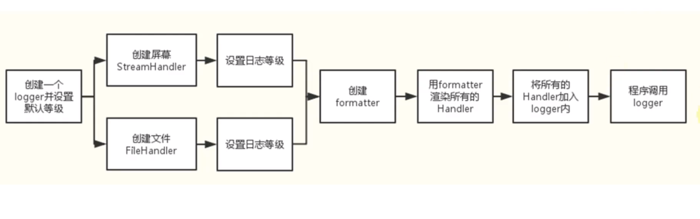
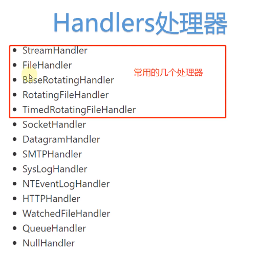
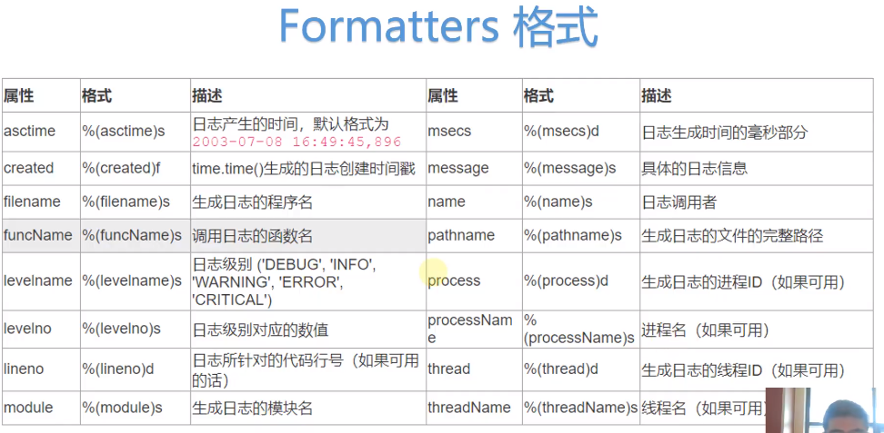

[toc]

# 日志详细介绍


loggers 记录器</br>
1、提供app的调用接口</br>
```python
logger = logging.getLogger(__name__)
```
`logger`是单例的

2、决定日志记录的级别</br>
`logger.setLevel()`

python日志级别：DEBUG < INFO < WARNING < ERROR < CRITICAL<br>

3、将日志内容传递到相关联的handlers中</br>
```python
logger.addHandler()
logger.removeHandler()
```





# 项目中使用日志的方式
- 编程的方式
- 配置文件(.conf)的方式
  优点：不修改代码只修改配置文件
- 字典的方式
  优点：可以从数据库或xml等其它源读取配置，处理成字典后读取


<br><br>
# Markdown 常用语法
Markdown 目录：
[TOC]

Markdown 标题：

## 这是 H2
### 这是 H3

Markdown 列表：
- 列表项目
1. 列表项目

*斜体*或_斜体_
**粗体**
***加粗斜体***
~~删除线~~

Markdown 插入链接：
[链接文字](链接网址 "标题")

Markdown 插入图片：


Markdown 插入代码块：
    ```python
    #!/usr/bin/python3
    print("Hello, World!");
    ```

Markdown 引用：
> 引用内容

Markdown 分割线：
---

Markdown 换行：
<br>

Markdown 段首缩进：
&ensp; or &#8194; 表示一个半角的空格
&emsp; or &#8195;  表示一个全角的空格
&emsp;&emsp; 两个全角的空格（用的比较多）
&nbsp; or &#160; 不断行的空白格